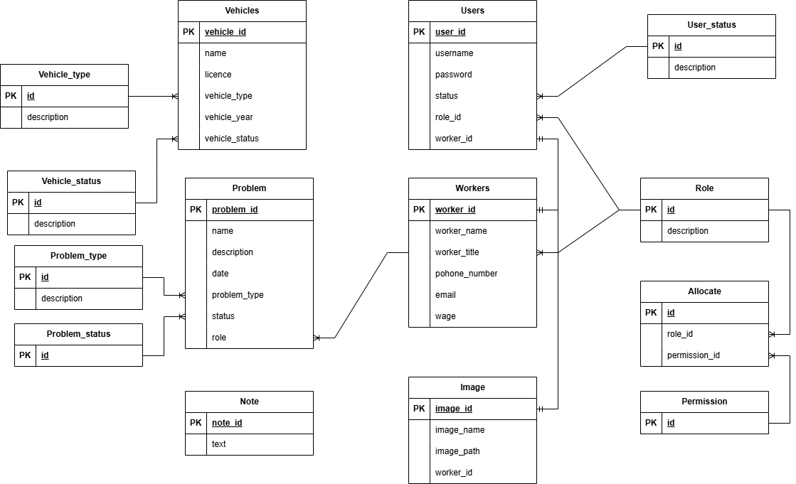

= Adatbázis felépítése és működése

== Adattáblák

=== Adattáblák rövid leírása
==== Járművek tábla
[cols="1,1,1"]
|===
|Oszlop név|Típus | Leírás

|vehicle_id
|INT
|Egyedi azonosító

|name
|VARCHAR(30)
|A jármű neve

|licence
|VARCHAR(10)
|A jármű rendszáma

|vehicle_type
|VARCHAR(100)
|A jármű típusa(enum)

|vehicle_year
|INT
|A jármű évjárata

|vehicle_status
|VARCHAR(30)
|A jármű állapota(enum)
|===

==== Problémák tábla
[cols="1,1,1"]
|===
|Oszlop név|Típus | Leírás

|problem_id
|INT
|Egyedi azonosító

|name
|VARCHAR(50)
|A probléma megnevezése

|description
|VARCHAR(100)
|A probléma leírása

|datum
|VARCHAR(30)
|A probléma rögzítésének dátuma

|problem_type
|VARCHAR(30)
|A probléma típusa(enum)

|status
|VARCHAR(30)
|A probléma státusza(enum)

|role
|VARCHAR(30)
|A problémát megoldó dolgozó munkaköre(enum)
|===

==== Felhasználók tábla
[cols="1,1,1"]
|===
|Oszlop név|Típus | Leírás

|id
|INT
|Egyedi azonosító

|username
|VARCHAR(30)
|A felhasználó felhasználóneve

|password
|VARCHAR(100)
|A felhasználó jelszava

|role_id
|VARCHAR(30)
|A felhasználó munkakörének megnevezése(enum)

|status
|VARCHAR(30)
|A felhasználó állapota(enum)

|worker_id
|INT
|A felhasználóhoz tartozó dolgozó egyedi azonosítója
|===